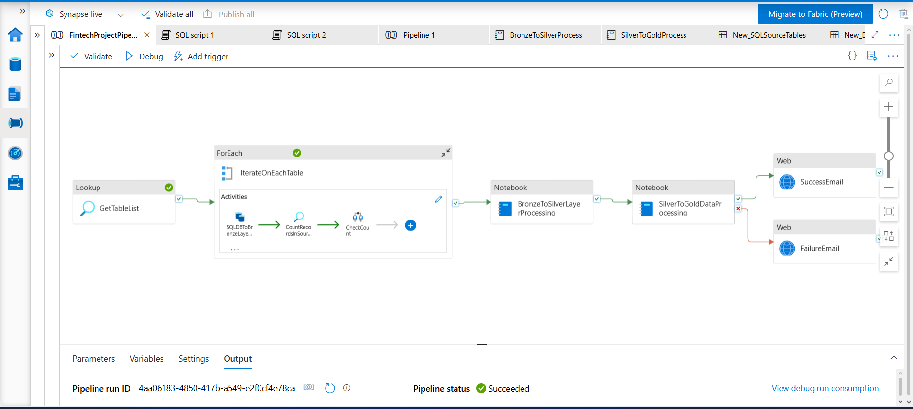

# 🚀 Enterprise FinTech Data Lakehouse Pipeline on Azure Synapse Analytics

> **An enterprise-grade Azure Data Engineering solution that ingests, validates, transforms, and models FinTech data using Azure Synapse Analytics, PySpark, Delta Lake, Medallion Architecture, and Azure Logic Apps.**


---

# 📌 Project Overview

This project demonstrates an **end-to-end Azure Data Engineering pipeline** built on **Azure Synapse Analytics** for a fictional FinTech organization.

The solution extracts transactional data from an Azure SQL Database, loads it into Azure Data Lake Storage Gen2, validates data quality, performs business transformations using PySpark, implements the Medallion Architecture (Bronze → Silver → Gold), and sends automated email notifications upon pipeline completion using Azure Logic Apps.

The project showcases a production-style data engineering workflow with metadata-driven ingestion, validation, transformation, dimensional modeling, and orchestration.

---

# 🎯 Business Problem

Financial organizations generate large volumes of customer, account, loan, transaction, and payment data from operational systems.

Business users require:

- Reliable data ingestion
- Data quality validation
- Clean and standardized datasets
- Analytics-ready data models
- Automated pipeline monitoring

This project addresses these requirements using Azure Synapse Analytics.

---

# 🏗 Solution Architecture

```
                    Azure SQL Database
                           │
                           ▼
                  Lookup Activity
                           │
                           ▼
                     ForEach Activity
                           │
                           ▼
                    Copy Activity
                           │
                           ▼
            ADLS Gen2 Bronze Layer (Parquet)
                           │
                           ▼
          Source vs Target Record Validation
                           │
                           ▼
            Bronze → Silver PySpark Notebook
                           │
                           ▼
          ADLS Silver Layer (Delta Format)
                           │
                           ▼
            Silver → Gold PySpark Notebook
                           │
                           ▼
           Gold Layer (Fact & Dimension Tables)
                           │
                           ▼
              Azure Logic App Notification
```

---

# ☁ Azure Services Used

| Service | Purpose |
|----------|----------|
| Azure SQL Database | Source system |
| Azure Data Lake Storage Gen2 | Data Lake |
| Azure Synapse Analytics | Data Integration |
| Synapse Pipelines | Workflow orchestration |
| Synapse Spark Pool | Distributed data processing |
| PySpark | Data transformation |
| Delta Lake | Storage format |
| Azure Logic Apps | Email notification |

---

# 🏛 Medallion Architecture

## 🥉 Bronze Layer

Raw data is copied from Azure SQL Database into Azure Data Lake Storage in **Parquet** format without transformation.

### Purpose

- Preserve raw source data
- Enable reprocessing
- Historical backup

---

## 🥈 Silver Layer

PySpark notebooks perform:

- Data cleaning
- Null validation
- Data standardization
- Derived column creation
- Business rule implementation
- Data quality validation

The output is stored as **Delta Tables**.

---

## 🥇 Gold Layer

Business-ready analytical tables are created.

Includes:

### Dimension Tables

- DIM_CUSTOMERS
- DIM_ACCOUNTS
- DIM_LOANS
- DIM_TIME

### Fact Tables

- FACT_TRANSACTIONS
- FACT_PAYMENTS
- FACT_CUSTOMER_ACCOUNTS

### Aggregate Tables

- Customer Summary
- Account Summary
- Loan Summary

---

# ⚙ Pipeline Workflow

The Synapse pipeline follows these steps:

1. Lookup Activity retrieves table metadata.
2. ForEach Activity dynamically iterates through all source tables.
3. Copy Activity loads data into Bronze Layer.
4. Lookup Activity retrieves source record count.
5. Script Activity counts Bronze records.
6. If Condition validates source and target counts.
7. Pipeline stops if validation fails.
8. BronzeToSilver PySpark notebook executes.
9. SilverToGold PySpark notebook executes.
10. Azure Logic App sends Success/Failure email notification.

---

# ✅ Data Validation Strategy

The pipeline validates data integrity before processing.

Validation performed:

- Source row count
- Bronze row count
- Record count comparison
- Pipeline failure on mismatch

This ensures reliable data ingestion.

---

# ✨ Silver Layer Transformations

Examples include:

- Trim whitespace
- Standardize text values
- Normalize account types
- Email masking
- Customer segmentation
- Loan risk categorization
- Payment categorization
- Transaction classification
- Derived business attributes
- Data quality logging

---

# 📊 Gold Layer Modeling

The Gold layer follows dimensional modeling principles.

Created objects include:

### Dimension Tables

- Customer
- Account
- Loan
- Time

### Fact Tables

- Transactions
- Payments
- Customer Accounts

### Aggregations

- Customer Summary
- Account Summary
- Loan Summary

These datasets are optimized for analytics and reporting.

---

# 📂 Repository Structure

```
Enterprise-FinTech-DataLakehouse/
│
├── Architecture/
├── Documentation/
├── Images/
├── LogicApp/
├── SQL/
│   ├── DatabaseScripts/
│   ├── ValidationQueries/
│   └── SampleData/
│
├── Synapse/
│   ├── Pipelines/
│   ├── Notebooks/
│   ├── LinkedServices/
│   ├── Datasets/
│   └── SQLScripts/
│
├── SampleOutput/
│
└── README.md
```

---

# 📸 Screenshots

## Pipeline



---

## Bronze → Silver Notebook

> *(Add screenshot)*

---

## Silver → Gold Notebook

> *(Add screenshot)*

---

## Storage Account

> *(Add screenshot showing Bronze / Silver / Gold folders)*

---

## Logic App

> *(Add screenshot)*

---

# 💡 Key Features

✔ Metadata-driven ingestion

✔ Dynamic Lookup + ForEach pipeline

✔ Data validation using row count comparison

✔ Medallion Architecture

✔ Delta Lake implementation

✔ PySpark transformations

✔ Dimensional Modeling

✔ Automated Email Notification

✔ Modular Synapse notebooks

✔ Enterprise-style folder organization

---

# 📈 Technologies Used

- Azure Synapse Analytics
- Azure SQL Database
- Azure Data Lake Storage Gen2
- Azure Logic Apps
- Azure Synapse Pipelines
- PySpark
- Spark SQL
- Delta Lake
- Python
- SQL

---

# 🚀 Future Enhancements

Possible improvements include:

- Incremental data loading
- Change Data Capture (CDC)
- Slowly Changing Dimensions (SCD Type 2)
- Unity Catalog integration
- CI/CD using Azure DevOps
- Infrastructure as Code using Bicep/Terraform
- Monitoring with Azure Monitor
- Power BI dashboard integration
- Data Quality Dashboard
- Pipeline alerting and retry framework

---

# 📚 Key Learnings

This project provided practical experience in:

- Azure Synapse Analytics
- Pipeline orchestration
- Dynamic ETL design
- Data Lake architecture
- PySpark transformations
- Delta Lake
- Medallion Architecture
- Data validation strategies
- Dimensional Modeling
- Azure Logic Apps integration

---

# 👨‍💻 Author

**Bhagwat Kshirsagar**

Azure Data Engineer

---

## ⭐ If you found this project useful, consider giving it a Star!
